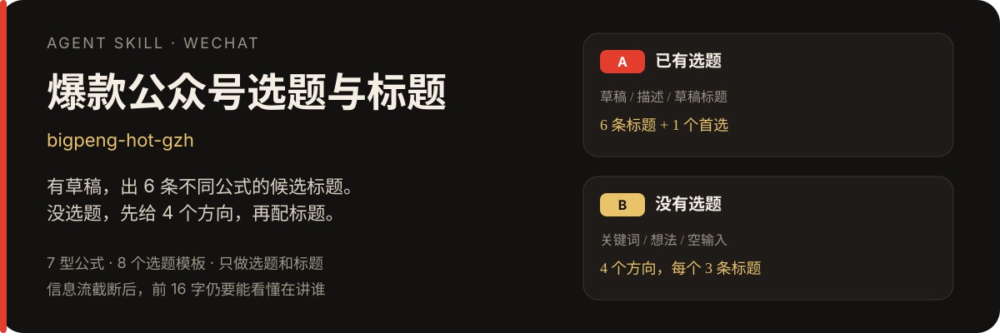
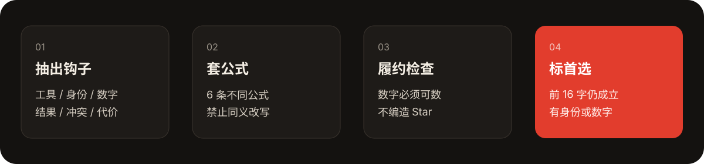

<p align="center">
  
</p>

<p align="center">
  <a href="./SKILL.md"></a>
  <a href="./LICENSE"></a>
  
  
</p>

给微信公众号起能点开的标题，或在还没想清楚写什么时，先给出可执行的选题方向。

有草稿、描述或草稿标题时，输出 **6 条分属不同公式的候选标题**，并标 1 个首选。只有关键词、一句话想法、或什么都不给时，先给 **4 个选题方向**，每个方向再配 3 条标题。

公式整理自一批真实爆款公号标题（AI 工具 / 效率赛道）。换到电商、体制内、教育时，复用槽位，不复用语料里的产品名。

**只做选题和标题，不写正文。**

<p align="center">
  
</p>

## 先看一次成功调用

把下面这段发给已安装本 skill 的 Agent：

```text
用 bigpeng-hot-gzh 帮我起几个爆款公众号标题。

草稿：我把最近两个月用 AI 做小红书封面的流程收成了 8 个 Skill，
从选题、文案、出图到封面文字都覆盖。目标读者是自己做号的中文创作者。
正文里会写每个 Skill 装法和一个真实用例。
```

会得到类似这样的结果（节选）：

| 公式 | 候选标题 | 正文必须兑现 |
|---|---|---|
| 数字清单 | 中文创作者必装的 8 个小红书封面 Skill | 真有 8 个，每个有装法和用例 |
| 我+代价+收获 | 我把小红书封面流程收成 8 个 Skill，从选题到出图不用再临时想 | 流程来自真实使用，不是空清单 |

**首选**通常是截断后仍成立、带身份或数字、且能兑现的那一条。例如：`中文创作者必装的 8 个小红书封面 Skill`。

更多输入见 [examples/prompts.md](examples/prompts.md)。

## 两条路径

| 你给了什么 | 走哪条 | 得到什么 |
|---|---|---|
| 文章描述、草稿、草稿标题，或「帮我起标题」 | **A** | 6 条标题 + 1 个首选 |
| 关键词、简单想法、「最近写点什么」、空输入 | **B** | 4 个方向 × 3 条标题 + 最值得先写 |

不确定时 Agent 会先问一句，不会两条一起跑。

空输入时会按当天热点搜索可写的新产品或事件，再套模板。不会把语料里的过时产品名直接当成「本周选题」。

## 标题怎么长得像能点

高转化标题通常同时有三件事：**具体对象 + 可感知结果 + 读者身份或情绪**。

7 型公式：

| 类型 | 结构 |
|---|---|
| 数字清单 | 身份 + 必装/推荐 + N 个 + 对象 |
| 我+代价+收获 | 我用 X 做了 Y（夸张量）+ 得到 Z |
| 反转结论 | 以为是 A，其实是 B / 不是 X，是 Y |
| 速成教程 | 时长或字数 + 精通/速通/保姆级 |
| 社会证明 | Star / 下载 / 大厂 / 热榜 + 对象 |
| 对比站队 | A 和 B 到底选哪个 / 实测 A 和 B |
| 情绪短句 | 短、口语；默认最多 1 条，且不当首选 |

8 个选题模板：必装清单、亲测复盘、从 0 到 1 教程、热点产品落地、对比抉择、开源神器安利、身份场景化、反常识/情绪钩。

写法上的硬约束：

- 主标题约 18–32 字；工具名尽量出现在前 16 字
- 数字必须具体（7、50、209 页），禁止「多个」「一系列」
- 标题写了「附教程 / 提示词 / 开源仓库」，正文就得真有
- 不编造 Star、下载量、实验样本量
- 6 条标题禁止同义改写
- 不用震惊、重磅、炸裂，也不写 `XX 发布了` 这种通稿

完整规则在 [references/title-formulas.md](references/title-formulas.md) 和 [references/topic-templates.md](references/topic-templates.md)。

## 安装

### Cursor

```bash
git clone https://github.com/BigPengSays/bigpeng-hot-gzh.git
cd bigpeng-hot-gzh
ln -sfn "$(pwd)" "${HOME}/.cursor/skills/bigpeng-hot-gzh"
```

### Claude Code / Codex 等

把本目录放到对应产品的 skills 路径，保证能读到 `SKILL.md`。入口文件是 [SKILL.md](./SKILL.md)。

## 还可以怎么用

**只有关键词，要选题：**

```text
用 bigpeng-hot-gzh 给几个公众号选题。
关键词：WorkBuddy，体制内办公
```

**什么都还没想好：**

```text
用 bigpeng-hot-gzh，最近公众号写点什么？
```

## 边界

- 不写正文、大纲、配图。写稿交给其他写作 skill。
- 不是推文 20 字短标题器。这是给公众号信息流用的偏长标题。
- 语料偏 AI 工具赛道。换赛道时只复用公式，不要把 Codex / WorkBuddy / Skill 硬套进去。
- 社会证明类标题没有公开可查数字时，会改用清单或教程公式，而不是编一个星标数。

## 仓库结构

```text
bigpeng-hot-gzh/
├── SKILL.md
├── README.md
├── LICENSE
├── assets/readme/          # README 用的 SVG
├── examples/prompts.md     # 三类调用样例
└── references/
    ├── topic-templates.md  # 8 个选题模板
    ├── title-formulas.md   # 7 型公式与禁用规则
    ├── title-corpus.md     # 真实标题样本
    └── qa-checklist.md     # 发出前检查
```

## License

[MIT](./LICENSE) · 作者 [BigPeng](https://github.com/BigPengSays)
